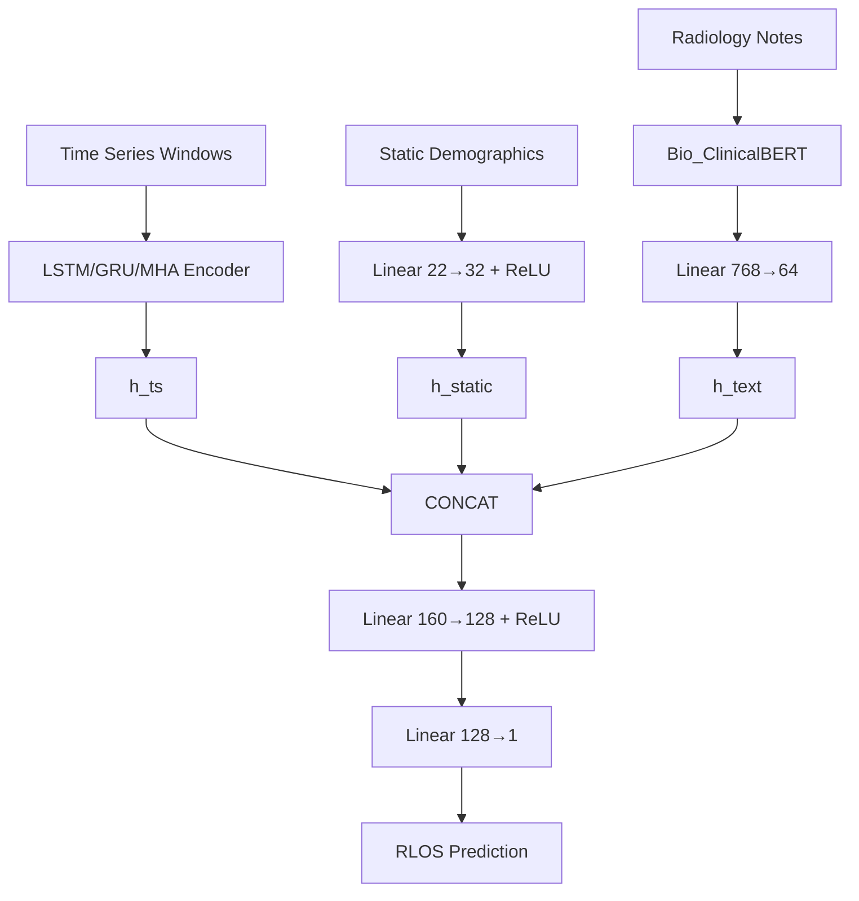

<div align="center">

<h1>ICU Remaining Length-of-Stay Prediction</h1>
<p><em>A Multimodal Deep Learning Pipeline for MIMIC-IV</em></p>
<p>
<a href="https://www.python.org/downloads/release/python-3110/"></a>
<a href="https://pytorch.org/"></a>
<a href="https://physionet.org/content/mimiciv/2.2/"></a>
<a href="https://github.com/huggingface/transformers"></a>
</p>
</div>

<hr>

This project implements a comprehensive multimodal deep learning pipeline designed to predict a patient's **remaining time-to-discharge** (RLOS) from the Intensive Care Unit (ICU). By leveraging the **MIMIC-IV** database, the model dynamically fuses three distinct data modalities to achieve highly accurate prognostic predictions:

| Modality | Source Table | Deep Learning Branch |
| :--- | :--- | :--- |
| 📈 **Time Series** | `MIMIC-IV-time_series` | **LSTM / GRU / Multi-Head Attention (MHA)** |
| 🧑‍⚕️ **Demographics** | `MIMIC-IV-static` | **Linear Encoder** |
| 📝 **Radiology Notes**| `MIMIC-IV-text` | **Bio_ClinicalBERT → Linear Encoder** |
-----

## 🚀 Quick Start

You can verify the best experimental results out-of-the-box in just three steps. This will run the optimal configuration: **MHA Encoder** combined with the **ts\_static\_text** (Time Series + Demographics + Radiology Notes) variant.

**1. Env & Install dependencies**

You can choose to use Conda 🛠️ or uv 🛠️ to manage your Python environment. (Python Version 3.11 ✅)

- Option A: Conda

```bash
# Create and activate the environment
conda create -n sph6004_env python=3.11
conda activate sph6004_env
# Install dependencies
pip install -r requirements.txt
```

- Option B: UV (recommended, faster)

```bash
# Create a virtual environment and synchronize dependencies
uv venv -p 3.11
source .venv/bin/activate
uv pip install -r requirements.txt
```

**2. Prepare the Data**
Place the three raw MIMIC-IV CSVs in the `data/origin/` directory:

```text
data/origin/
├── MIMIC-IV-static(Group Assignment).csv
├── MIMIC-IV-text(Group Assignment).csv
└── MIMIC-IV-time_series(Group Assignment).csv
```

**3. Run the Pipeline**

```bash
python main.py
```

> **Note:** The pipeline is idempotent. It automatically skips preprocessing and training steps if their respective checkpoints already exist.

-----

## 🔬 Full Experiment Workflow

If you wish to reproduce the full architectural search and modality ablation study, follow this step-by-step workflow:

### Step 0: Data Preprocessing

Fits all feature preprocessors on the training split and caches ClinicalBERT embeddings. Must be run once before any training script.

```bash
python -m scripts.prepare_data
```

*(Outputs: `checkpoints/preprocessors.pkl`, `data/cache/text_embeddings.pkl`)*

### Stage 1: Time-Series Baseline Search

Train independent encoder architectures on time-series features to identify the strongest temporal backbone.

```bash
python -m scripts.training.baseline --arch lstm
python -m scripts.training.baseline --arch gru
python -m scripts.training.baseline --arch mha
```

Evaluate and compare baselines:

```bash
python -m scripts.evaluate.compare_baselines
```

### Stage 2: Multimodal Ablation

Using the Stage 1 winner (e.g., `mha`), freeze the TS encoder weights and train the new modality branches to analyze feature contributions.

```bash
python -m scripts.training.multimodal --ts_arch mha --variant ts_static
python -m scripts.training.multimodal --ts_arch mha --variant ts_text
python -m scripts.training.multimodal --ts_arch mha --variant ts_static_text
```

Compare all Stage 1 + Stage 2 results comprehensively:

```bash
python -m scripts.evaluate.compare_multimodal --ts_arch mha
```

-----

## 🧠 Model Architecture



-----

## 📊 Data Pipeline Details

### Quick Data Viewer

For rapid debugging and feature inspection without loading the massive MIMIC-IV dataset:

```bash
python data/quick_viewer.py
```

*This extracts the first 2000 lines and saves lightweight files to `data/processed/`.*

### Core Processing Logic

  * **Cohort Filter:** Retains only ICU stays where patients were discharged alive (`icu_death_flag == 0`). Target is time-to-discharge, not time-to-death.
  * **Split Strategy:** 8:1:1 (Train:Val:Test) strictly partitioned at the `stay_id` level to prevent patient data leakage.
  * **Time-Series Handling:** Missing data handling depends on the missing rate:
      * `< 15%` or `15-90%`: Clip outliers → Last Observation Carried Forward (LOCF) → Head-fill with train median + Observation Mask.
      * `≥ 90%`: Replaced with an `ever_measured[t]` binary indicator.
  * **Windowing:** Fixed 24-hour look-back window. Labels are calculated as `RLOS(t) = icu_los_hours − elapsed_hours(t)`, clamped to ≥ 0.
  * **Text Caching & Pooling:** Radiology notes are embedded via Bio\_ClinicalBERT. Notes are fused using **time-aware weighted pooling** (`weight ∝ exp(−Δt)`). A learnable `NO_NOTE` token handles time steps without notes to avoid silence.

-----

## 🏗️ Project Structure

```
project/
├── main.py                                ← quick verify best result
├── requirements.txt
│
├── configs/
│   ├── model/ts_encoder/
│   │   ├── lstm.yaml                      ← LSTM hyperparams + rationale
│   │   ├── gru.yaml                       ← GRU hyperparams + rationale
│   │   └── mha.yaml                       ← MHA hyperparams + rationale
│   └── training/
│       ├── baseline.yaml                  ← Stage 1 training config
│       └── multimodal.yaml                ← Stage 2 training config
│
├── scripts/
│   ├── prepare_data.py                    ← Step 0: fit + save preprocessors
│   ├── training/
│   │   ├── baseline.py                    ← Stage 1: train one arch
│   │   └── multimodal.py                  ← Stage 2: train one variant
│   └── evaluate/
│       ├── compare_baselines.py           ← Stage 1 comparison + plots
│       └── compare_multimodal.py          ← Stage 1 + 2 combined comparison
│
├── src/
│   ├── data/
│   │   ├── loader.py                      ← load & filter cohort
│   │   ├── splitter.py                    ← 8:1:1 stay_id split
│   │   ├── static_preprocessor.py        ← demographics features
│   │   ├── ts_preprocessor.py            ← TS features (LOCF, masks, ever_measured)
│   │   ├── text_preprocessor.py          ← Bio_ClinicalBERT + time-aware pooling
│   │   ├── ts_dataset.py                 ← TSOnlyDataset  (Stage 1, fast)
│   │   └── dataset.py                    ← ICUDataset full multimodal (Stage 2)
│   ├── models/
│   │   ├── encoders/ts_encoder.py        ← LSTM / GRU / MHA — single source
│   │   ├── ts_only.py                    ← Stage 1 model
│   │   └── multimodal.py                 ← Stage 2 model (frozen TS + modalities)
│   ├── training/
│   │   ├── loss.py                       ← LogMSELoss + decode_log_pred
│   │   └── trainer.py                    ← generic Trainer (legacy, used by main.py v1)
│   └── utils/
│       ├── constants.py                  ← clip ranges, mappings, paths
│       ├── metrics.py                    ← MAE, RMSE, MedAE, R²
│       └── persistence.py               ← save/load preprocessors
│
├── data/origin/                          ← raw CSVs (gitignored)
├── checkpoints/                          ← model checkpoints (gitignored)
├── outputs/                              ← per-run artefacts (gitignored)
└── results/
    ├── ts_baseline_comparison.csv
    ├── multimodal_comparison.csv
    └── plots/
```
-----

## ⚙️ Key Design Decisions

| Decision | Implementation Rationale |
| :--- | :--- |
| **Log-space Training** | Targets are transformed via `log1p(RLOS)` to gracefully handle the heavy-tailed length-of-stay distribution. |
| **Strict Data Isolation** | Preprocessors fit *only* on train splits. Validation/Test sets are scaled strictly using train statistics. |
| **Stage 2 Feature Freezing** | TS encoder weights are loaded from Stage 1 and frozen during multimodal ablation to ensure a fair analysis of new modality contributions. |
| **Single Encoder Interface** | `src/models/encoders/ts_encoder.py` hosts all 3 sequence models with identical input/output shapes for hot-swapping via YAML. |
| **W\&B Integration** | Automated metric logging and run tracking (requires `WANDB_API_KEY` environment variable). |

-----

## 🔧 Extending the Code

Customizing the pipeline is straightforward. Refer to this mapping:

| Target Modification | Target File |
| :--- | :--- |
| **Add/Remove Features** | `src/data/static_preprocessor.py` or `src/ts_preprocessor.py` |
| **Adjust Clinical Thresholds** | `src/utils/constants.py` → `CLINICAL_CLIP_RANGES` |
| **Change Window Size** | `src/utils/constants.py` → `WINDOW_SIZE` |
| **Swap BERT Backbone** | `src/utils/constants.py` → `BERT_MODEL_NAME` |
| **Tune Model Architectures** | `configs/model/ts_encoder/*.yaml` |
| **Modify Training Dynamics**| `configs/training/*.yaml` or CLI arguments |
| **Update Loss / Metrics** | `src/training/loss.py` or `src/utils/metrics.py` |

-----
## 📋 Data Declaration

The dataset is derived from [MIMIC-IV](https://physionet.org/content/mimiciv/) and is **not included**(.gitignore) in this repository due to data access agreements. Access requires completing the required CITI training and signing the PhysioNet data use agreement.

------

## 📜 License

**© National University of Singapore (NUS). All Rights Reserved.**

**This Repo is strictly for official use by NUS Course SPH6004 AY25/26 Group 6 only.**  
Unauthorized distribution, reproduction, or sharing is strictly prohibited.